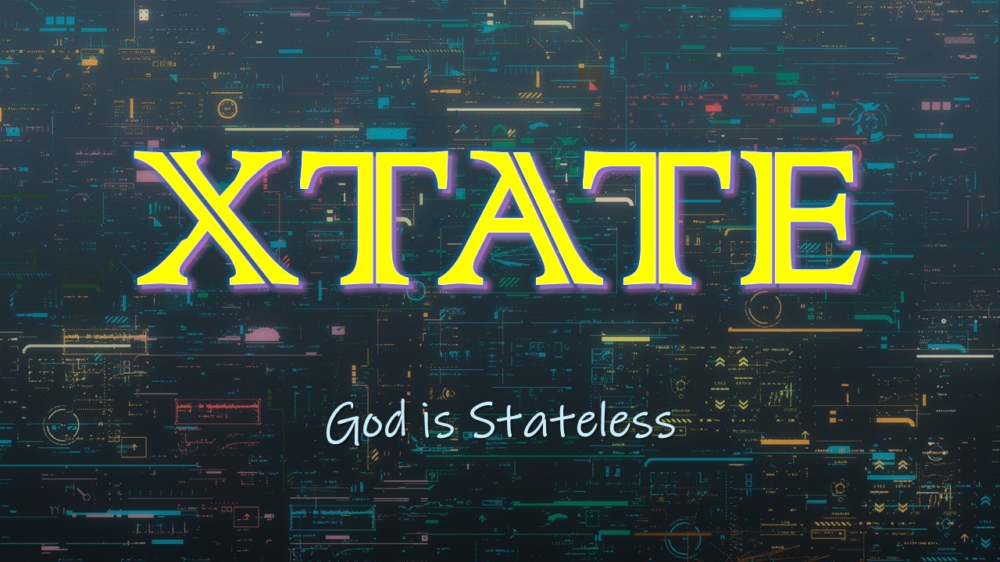

# XTATE

Welcome to Xtate -- A modular all-stack network scanner for next-generation internet surveys!

Xtate focus on large-scale active measurement of protocol themselves and underlying characteristics they reflect.
In other words, Xtate is not good at being a crawler or concentrating on contents like other specific scanners. (Although Xtate has that abilities...)

PS: Xtate was originally designed to do all scans in complete stateless manner, but some new features and modules make it more than stateless. But being fast and concise is always our target.

## Build

Xtate could be built both on Linux and Windows with CMake because of cross-platform code and optional dependencies.
If any error happened in CMake, trying to modify and use `Makefile` is a good idea.
I'm sorry about my fail to be a CMake professor...

### Depencendies

Dependent libraries for building:

- OpenSSL>=1.1.1 (optional or use `-DWITH_OPENSSL=<ON/OFF>` to switch explicitly)
- PCRE2 8bits (optional or use `-DWITH_PCRE2=<ON/OFF>` to switch explicitly)
- LibXml2 (optional or use `-DWITH_LIBXML2=<ON/OFF>` to switch explicitly)

Optional dependencies for building won't be compiled with if Cmake didn't find the packages on your system or you can switch off it by CMake parameters.

Dependent libraries for running:

- libpcap(Linux)
- winpcap/npcap(Windows)
- PFRING driver(optional on Linux)
- lua5.3/5.4(optional for lua probe support)

All of them can be installed on Windows in some way you like but always easier on Linux like Ubuntu22:

```
sudo apt install libpcap-dev libssl-dev libpcre2-dev libxml2-dev liblua5.X-0
```

### Compile On Linux

Recommended compile suites:

- GCC
- Clang

With dependencies installed we can build xtate by CMake with parameters or with given script quickly:

```
./build.sh [debug]
```

### Compile On Windows

Recommended compile suites:

- MSVC
- MinGW-w64

Generate a Visual Studio solution with MSVC as compiler:

```
cd build
cmake .. -DVCPKG_TARGET_TRIPLET=x64-windows
```

Generate a Makefile with MinGW-w64 as compiler:

```
cd build
cmake .. \
    -G "Unix Makefiles" \
    -DCMAKE_BUILD_TYPE=<Debug/Release> \
    -DVCPKG_TARGET_TRIPLET=x64-windows
make -j4
```

## Intro

Use `xtate --intro` to see the workflow of xtate.

## Usage

Use `xtate --usage` to see the basic usages of xtate.

## Helps

Use `xtate --help` to see all parameters and help of xtate.

Use `xtate --list-scan` to see all ScanModules with sub-parameters and help.

Use `xtate --list-probe` to see all ProbeModules with sub-parameters and help.

Use `xtate --list-out` to see all OutputModules with sub-parameters and help.

# Author

Xtate was created by lfishRhungry:
- email: chenchiyu14@nudt.edu.cn

Xtate was born from
[Masscan](https://github.com/robertdavidgraham/masscan/tree/master)
and referenced
[ZMap](https://github.com/zmap/zmap),
[Masscan-ng](https://github.com/bi-zone/masscan-ng)
and other excellent open-source projects.

Thanks to Robert Graham, Zakir Durumeric and Konstantin Molodyakov for their greate code and rigorous style.
I've learned more than just finishing my worthless graduate thesis.

# License

Copyright (c) 2024 lfishRhungry

This program is free software: you can redistribute it and/or modify
it under the terms of the GNU Affero General Public License as published by
the Free Software Foundation, version 3 of the License.

This program is distributed in the hope that it will be useful,
but WITHOUT ANY WARRANTY; without even the implied warranty of
MERCHANTABILITY or FITNESS FOR A PARTICULAR PURPOSE.  See the
GNU Affero General Public License for more details.

You should have received a copy of the GNU Affero General Public License
along with this program.  If not, see <https://www.gnu.org/licenses/>.
